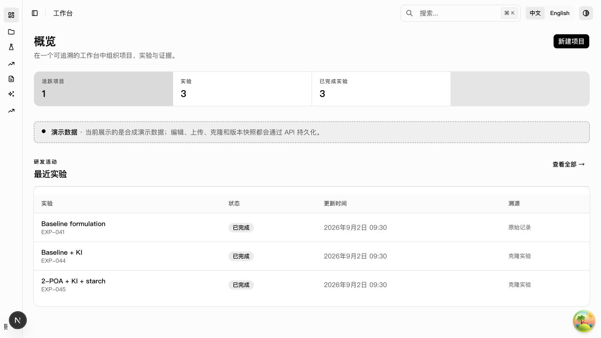
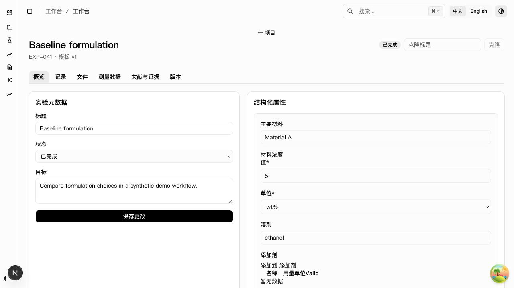
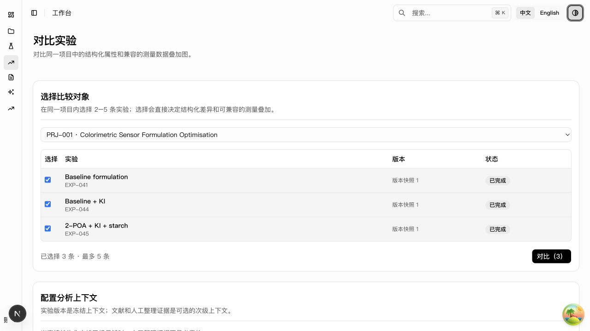
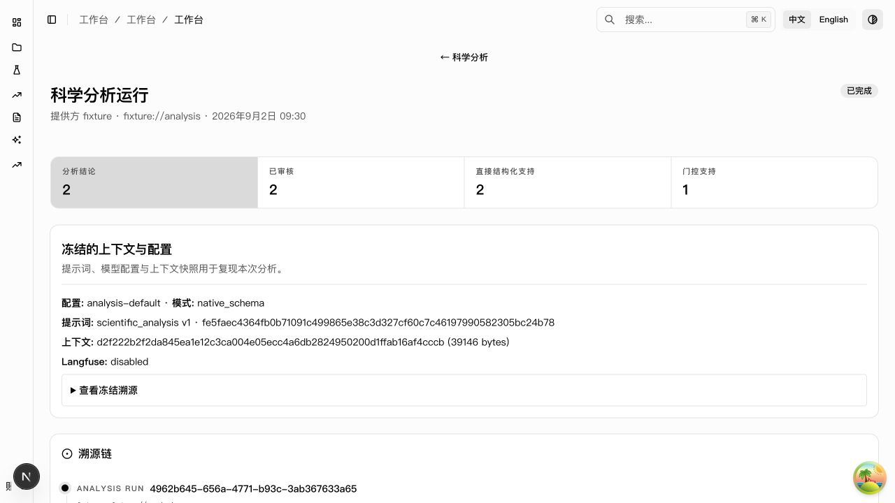
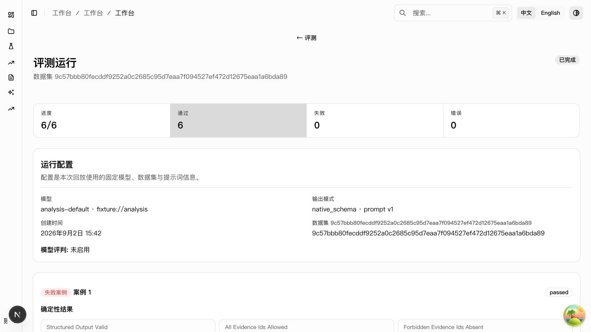

# Scientific R&D Workspace — Codex Project Pack v0.1

本文件包用于从一个空目录启动 **Scientific R&D Workspace** 的第一个可执行开发阶段。

目标不是从零开发完整 ELN/LIMS，而是快速组合成熟开源能力，先完成一个可以真实录入实验、保存、克隆和追溯版本的科研工作台底座，再逐步扩展到实验数据比较、Evidence Gate 和 AI Evaluation。

## 这个包里有什么

```text
AGENTS.md
ARCHITECTURE.md
README.md
docs/
├── PRODUCT_SPEC.md
├── DATA_MODEL.md
├── UI_SPEC.md
├── DEMO_SCENARIO.md
├── OPEN_SOURCE_STRATEGY.md
├── CODEX_PROMPTS.md
├── exec-plans/
│   ├── 01-foundation-eln.md
│   ├── 02-scientific-workflow-scope.md
│   ├── 02-scientific-workflow.md
│   └── 03-scientific-ai-scope.md
├── handoff/
│   ├── PHASE_1_HANDOFF.md
│   ├── PHASE_2_HANDOFF.md
│   ├── UI_REBUILD_PLAN_2_HANDOFF.md
│   └── PHASE_HANDOFF_TEMPLATE.md
├── assets/ui/
    ├── overview-zh.png
    ├── experiment-detail-zh.png
    ├── compare-zh.png
    ├── analysis-detail-zh.png
    └── evaluation-detail-zh.png
└── references/
    └── SOURCES.md
```

## 当前阶段

**Closed phases：Phase 1 — Foundation + ELN Core；Phase 2 — Scientific Workflow**

Phase 1 已完成并通过：

> Project → Experiment → Structured Properties → Rich Note → Attachment → Save → Clone → Revision History

Phase 2 已完成并通过：

> Raw Attachment → Import → Measurement → Plot → Compare → Literature → Evidence

Phase 1 基线为 `9bb494d`。Phase 2 的 PostgreSQL 17 GitHub Actions 验收在提交 `939bf82` 上通过；详情见 `docs/handoff/PHASE_2_HANDOFF.md`。Phase 3 M1–M10 已完成，外部 DeepSeek LiteLLM `json_object` smoke 已通过，发布标签为 `v0.1-demo`。当前确切状态与验证证据见 `docs/handoff/PHASE_3_HANDOFF.md`。

当前 UI Plan 1 已完成，并已完成正式 Plan 2 的 full-site UI rebuild + portfolio polish：中文 `zh-CN` 为默认 locale，英文 `en` 可切换；locale 通过 first-party cookie 持久化，不改变 URL。最终 UI direction、catalog contract、验收边界与交付证据见 `docs/UI_SPEC.md`、`docs/handoff/UI_I18N_PLAN_1_HANDOFF.md` 和 `docs/handoff/UI_REBUILD_PLAN_2_HANDOFF.md`。

## Finished product

Scientific R&D Workspace 是一个以项目、实验、测量、文献、分析和评测为主线的可追溯科研工作台。最终产品壳保持中文优先、英文可切换、轻量表格/列表优先，并把 Evidence Gate、Confidence、人工审核、冻结上下文和 provenance 作为一等信息，而不是把科学内容包装成泛化 dashboard 卡片。

推荐演示路径：`Overview → Projects → PRJ-001 → EXP-045 → Measurements → Compare EXP-041/044/045 → Analysis Detail → human review → Evaluations → Evaluation Detail → Suggested Draft Experiment`。本地 demo seed 提供真实 API 数据；建议从 `http://localhost:3000/dashboard/overview` 开始。

中文桌面端关键界面：











界面契约保持不变：默认中文、`English` 可切换、URL 不增加 locale prefix、`scientific_workspace_locale` 持久化 locale；API/DB enum、scientific prose、Finding 内容、论文元数据和用户输入不被翻译。建议实验草稿由审核后的 Finding 带入，但仍必须经过 schema-driven 表单复核和明确提交。

## 阶段执行记录

1. Phase 1 按 `docs/exec-plans/01-foundation-eln.md` 完成并关闭。
2. Phase 2 基于冻结的 Phase 1 架构生成并执行 `docs/exec-plans/02-scientific-workflow.md`。
3. Phase 2 的 PostgreSQL 17、后端和前端门禁已通过 GitHub Actions。
4. Phase 1/2 的最终证据分别记录在 `docs/handoff/PHASE_1_HANDOFF.md` 和 `docs/handoff/PHASE_2_HANDOFF.md`。
5. Phase 3 M1–M10 已按批准计划实现并通过 PostgreSQL 17、前端、浏览器和外部 live LiteLLM 门禁；当前发布为 `PHASE 3 PASS`，标签为 `v0.1-demo`。
6. UI Plan 1 与正式 UI Plan 2 已完成；Plan 2 只改前端展示层、共享 UI 组织和交付文档，不改变后端、数据库、API contract 或科学新功能。

## 核心原则

- 一个主产品壳，一个 canonical data model。
- 开源项目作为 starter、组件或独立 service 使用，不把多个完整产品源码硬 merge。
- Phase 1/2 不引入 LangGraph、Langfuse、MCP、pgvector 或 Zotero 运行时集成。
- 不为了未来需求提前制造微服务。
- 不重新开发富文本编辑器或通用 Schema Form Engine。
- 每个阶段必须保持可运行。
- UI 保持一致、清晰、可演示，并以最终的科学工作流与可追溯性 polish 为交付标准。
- Scientific schema、workflow、evidence 和 provenance 才是项目原创价值。

## Phase 1 技术基线

前端：
- Next.js 16
- React 19
- TypeScript
- Tailwind CSS
- shadcn/ui
- Kiranism `next-shadcn-dashboard-starter` 作为主壳
- JSON Forms 用于结构化实验字段
- BlockNote 用于实验富文本记录
- `next-intl` 用于中文优先的 UI 国际化（无 URL locale prefix）

后端：
- Python
- FastAPI
- SQLAlchemy 2
- Alembic
- PostgreSQL
- Pydantic

存储：
- PostgreSQL 保存结构化数据和 JSON 文档
- Phase 1 使用本地文件存储适配器保存附件
- 文件元数据写入 PostgreSQL

开发：
- Docker Compose 只负责 PostgreSQL 和必要的本地基础设施
- 前后端可以直接本机启动
- 必须提供一条明确的开发启动路径

## 阶段完成状态

Phase 1 和 Phase 2 的所有 P0 acceptance criteria 均已通过，并分别产出正式 handoff。Phase 2 的权威验收由 PostgreSQL 17 GitHub Actions workflow run `33522448986` 提供。

## Phase 1/2 本地启动

Prerequisites: Node.js 22+, npm, Python 3.11+, uv, and Docker Desktop (for PostgreSQL 17). Phase 1 has been audited against a real PostgreSQL 17.11 server; see `docs/handoff/PHASE_1_HANDOFF.md` for the closeout evidence.

```bash
cp api/.env.example api/.env
docker compose up -d postgres

cd api
uv sync
uv run alembic upgrade head
uv run python -m app.seed
uv run fastapi dev app/main.py
```

In another terminal:

```bash
cd web
npm install
npm run dev
```

Open [http://localhost:3000/dashboard/overview](http://localhost:3000/dashboard/overview). The Phase 1 routes are `/dashboard/overview`, `/dashboard/projects`, `/dashboard/projects/[projectId]`, `/dashboard/projects/[projectId]/experiments/new`, `/dashboard/experiments`, and `/dashboard/experiments/[experimentId]`.

Quality checks:

```bash
cd api && uv run pytest
cd web && npm run test && npm run lint && npm run typecheck && npm run build && npm run format:check
```

The API persists PostgreSQL records through SQLAlchemy/Alembic and attachment bytes through the local adapter at `data/uploads` (configurable with `STORAGE_ROOT`). `NEXT_PUBLIC_API_URL` can point the web client at another API base, defaulting to `http://localhost:8000/api/v1`.

### Docker-free local deployment

If Docker/PostgreSQL is not installed, use the local-only SQLite fallback. It uses the same Alembic schema and demo seed, stores the database at `data/local/scientific_rd.db`, and keeps PostgreSQL as the production/default path:

```bash
./scripts/start-local.sh
```

Open [http://127.0.0.1:3000/dashboard/overview](http://127.0.0.1:3000/dashboard/overview). Press `Ctrl-C` in the terminal to stop both services. To use the production-like path, install Docker Desktop and follow the PostgreSQL commands above instead.
