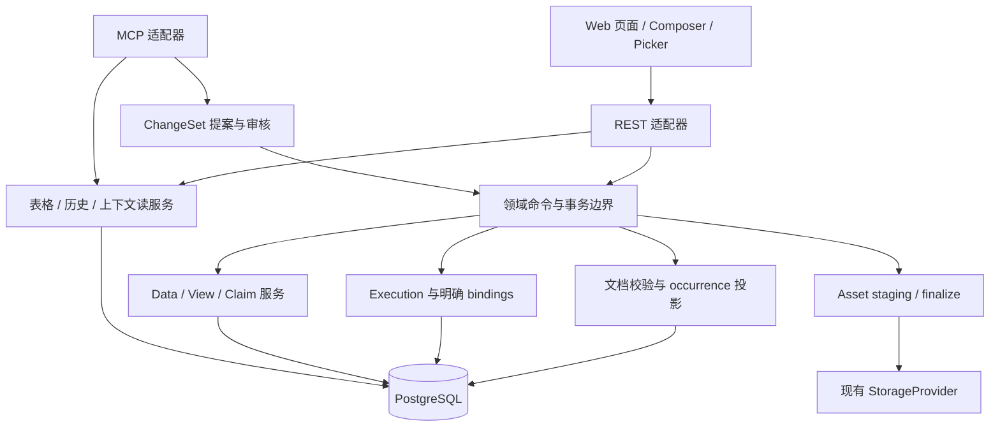

# 科研工作台核心工作流设计审查与修订建议 v1.4

> 设计历史：用户回应后的固定设计见 [v1.5 冻结基线](<科研工作台核心工作流产品与技术设计冻结基线 v1.5.md>)。本文保留审查过程与代码证据；Process mention、顺序、默认属性编辑方式及空实验入口等已被 v1.5 修订，不再作为未来实现依据。

审查日期：2026-09-05。代码基线：本地 `main@93700a6`。

状态：设计建议，尚未作为已实现契约生效。本文保留 v1.3 的主要产品方向，补齐领域语义、持久化、事务、历史读取和组件依赖边界。原稿不改写；`docs/current/` 仍描述现行 v0.3。

本次工作是文档与源码审查，没有执行产品代码重构、数据库迁移、依赖安装或发布。源码结论与设计推断在下文分别标明；没有把历史 CI 通过记录当成本次运行验证。

## 1. 审查结论

**整体可行，但属于一次中高复杂度的工作流重构，不能按“已有后端，加一层编辑器和表格”估算。**

值得保留的方向：连续科研正文、显式结构化引用、Sample 独立身份、Experiment 非拥有关系、Data 多 Representation、View 保存外部分析产物、Claim 从上下文创建、REST/MCP 共用领域服务。这些选择能减少长期业务分叉。

需要修订的重点集中在六处：

1. 文档引用、使用记录和真实 Process Execution 的语义不同，不能靠文本位置补出不存在的关系。
2. 无 Process 的 Data 也要有 subject，必须明确扩展现有 provenance 契约。
3. Sample 比较的显示列、行筛选必须分开，否则实验里不同配方的样品会被自动过滤掉。
4. 保存历史版本 ID 还不够：View/Claim 必须能读取对应的不可变内容，并保护其附件。
5. 多文件与批量保存需要服务端可恢复的提交协议，不能只拼接现有 HTTP 请求。
6. 完整嵌套 PropertySlot、ghost preview、键盘选区与撤销的组合是编辑器中的最高风险项，需要允许简化交互。

**推荐架构：文档是写作记录的权威来源；Execution 是明确执行事实的权威来源；两者以显式、版本化的关联连接。表格索引与 system relation 都是服务端可重建投影。**

这项选择有明确代价：普通正文不会自动得到完整的过程级因果图。它能确定“记录引用了什么、填写了什么”，只有显式执行 bindings 才能确定“哪个过程使用了什么、产生了什么”。若产品要求每次书写都自动形成后者，就必须增加用户明确关联的交互，不能同时坚持无归属、无确认，又承诺完整执行 provenance。

## 2. 当前仓库事实与冲突

### 2.1 代码基础确实可复用，但成熟度不同

| 能力 | 实际基础 | 审查判断 |
| --- | --- | --- |
| 统一对象与 scope | 七种 kind、Research Object tags、属性、版本、项目约束 | 保留 |
| Process | Definition/Version、Execution、bindings、execution revisions | 保留核心；不能作为任意文档 Ref 的通用存储 |
| Sample | `sample_record_service.py` 将 Sample 投影到执行序列 | 新文档保存不能直接复用当前 replace-steps 路径 |
| Data | Representation、raw/table/image/description/structured、import、Asset | 底层可复用；缺组合提交、获取正文更新和无过程 subject |
| Experiment | 独立 identity、references、revision | 关系模型保留，新增增量命令 |
| View | Data revision pin、ViewRevision、config | 补历史读取、输入版本选择、Artifact pin 与保留策略 |
| Claim | statement、作者来源、Evidence、ClaimRevision | 增加 Primary Source 与 Context，不替换 Evidence 语义 |
| 前端 | BlockNote 0.54.0、Base UI、Query、nuqs、Zod 已依赖 | 依赖可复用，业务组件大多仍需重写 |
| 验证 | 已有 PostgreSQL API、MCP 协议、浏览器 golden flow 等测试 | 保留基线；尚不覆盖本次新工作流 |

当前 Sample Composer 是 681 行的 step/binding 表单；不是已经实现了连续正文的 Scientific Composer。`domain-workspaces.tsx` 是 395 行，问题主要是多个业务的请求、状态和展示混放，不能仅用“大文件”判断是否删除。

### 2.2 必须修正或澄清的问题

以下位置均以本地 `93700a6` 为准，文件名加函数名可直接检索。

| 优先级 | 发现与源码证据 | 影响 | 修订方向 |
| --- | --- | --- | --- |
| 阻断 | `schemas.py:365/373` 的 create 和 put 都要求至少一个 step；`sample_record_service.py:_step_payload` 将最后一步设为 product output；`_rebuild_sample_sequence` 自动创建 precedes | 放开 `min_length` 不能独自完成语义重构；新正文保存可能改变旧执行关系 | 文档保存与执行保存分离；不得用段落顺序生成执行顺序 |
| 阻断 | `process_execution_service.py:_replace_bindings`、`_sync_provenance` 只从 producer 的 `input + subject` 推导 Data subject；Execution 强制 Definition/Version | “无 Process 上传”与“Sample 内随手记观察自动关联 subject”不能同时由现有 API 实现 | 增加显式 Data subject assignment，统一投影逻辑，见第 5 节 |
| 阻断 | `view_service.py:_replace_refs` 保存最新 Data revision；`_view_body` 使用 `get_object(data_id)` 返回当前对象；`update_view` 接收 `data_ids` 时重绑到最新版本 | pin 已存在，但页面数据仍可能漂移；AI 分析期间输入变化也可能钉错版本 | 调用方提供读到的版本，服务端校验归属；按 manifest 读取历史 |
| 阻断 | `idempotency_service.py:run_idempotent` 先执行会自行 commit 的业务函数，再另行 commit 幂等记录 | 两次 commit 之间崩溃可能已创建对象却无 replay 记录；同 key 并发也不能仅靠不存在记录上的锁解决 | 业务写入、幂等结果、revision 在同一事务提交 |
| 阻断 | v1.3 第 34–36 节将选列与 AND 过滤绑定，第 63 节自动取实验样品属性并集 | 自动选出所有列若同时启用筛选，会排除缺少任意一种原料的样品 | `required_refs` 与 `display_columns` 独立 |
| 高 | `experiment_record_service.py:_replace_refs` 删除全部再添加；`ExperimentRecordPut.references` 默认空列表 | 只改标题或添加一个样品若使用不完整 payload，可清空其他引用 | metadata patch、add/remove/reorder refs 分开 |
| 高 | `schemas.py:ClaimCreate.source_type` 是 human/literature/ai/analysis/external，`source_ref` 是字符串 | 不能直接将其改成 Experiment/Data/View；会混淆作者来源和科研来源 | 保留 author provenance，新增 typed Primary Source/Context |
| 高 | `DataRecordPut` 与 `update_data_record` 不处理 acquisition `content_document` | DTO 的 `extra=allow` 不等于字段会落库，可能产生“请求成功但没保存” | 新增显式文档契约，未知写入字段拒绝 |
| 高 | `web/src/lib/api-client.ts:258` 仍有 `setDataRelations`，但当前 router 没有对应 `/data/{id}/relations` 路径 | “API client 已有”不能当作功能已接通；直接调用还违反 system relation 规则 | 删除无效调用，改为领域级 subject 操作 |
| 高 | `SampleComposer.chooseObject` 按对象 ID 去重；binding 更新删除后重新创建 binding rows | 同对象多次 occurrence 未实现；不能把 binding row ID 当稳定 occurrence ID | 独立 occurrence UUID 与复制/移动规则 |
| 高 | `SampleComposer.submit` 更新未传 If-Match；router 先检查摘要再调用写入服务 | 前端没有落实并发保护；检查与写入还需处于锁保护内 | 命令服务锁住被编辑聚合，再检查版本、写入 |
| 高 | `delete_object_route` 直接删除；ObjectRevision、DataRepresentation 存在随对象级联的 FK；View pin 的 FK 可 SET NULL | 部分引用有数据库保护，但不能据此承诺所有历史证据永远可读 | 默认归档；历史引用与 manifest 完整性检查 |
| 高 | `ProcessExecutionObjectBinding` 固定字段定义/使用值，但没有对象 revision pin；`ProcessExecutionDataBinding` 只有 Data ID，没有输入 Data revision pin | 能追到身份，不等于能恢复当时样品属性或计算输入版本 | 新明确执行记录补输入版本；旧数据不伪造历史版本 |
| 中 | `upload_asset` 自行提交 ObjectAssetLink，不创建 ViewRevision；`AssetOut` 不暴露 link role/order；`delete_asset` 拒绝仍有任何 link 的附件 | 普通上传并不自动成为版本化主 Artifact；当前 delete 也不是“从某对象移除附件” | 区分 unlink、删除 bytes、选择主 Artifact |
| 中 | `_create_representation_in_session` 对 asset 仅查存在，未在这里检查目标对象 link/scope | 组合提交不能信任任意 asset ID | 服务端校验 attachment 归属、scope、完成状态、校验和 |
| 中 | `SampleList` 与候选只取 100 条；generic search 还搜 tags/properties；`get_data_record` 包含 table_rows | 不适合作为完整科学表格查询和大文件列表 DTO | 新增分页读模型、批量投影、懒加载 representation 内容 |

以上是源码能确定的路径和风险，并非已经复现所有竞态、数据损坏或浏览器故障。特别是事务崩溃窗口，需要实现时以故障注入验证。

### 2.3 当前资料需要收敛

`README.md` 仍描述旧 Sample/Material/Equipment kind、contains/uses/produces 和 Experiment Comparison；与当前根目录 AGENTS、CURRENT_STATE、模型和服务不符。`web/AGENTS.md` 也残留“正式支持 Experiment Comparison”的表述，而现行 UI_SPEC 和详情组件是 reference surface。

以当前模型和服务为准。设计冻结并实现后应同步更新 README、架构、current API、MCP、UI 契约和 handoff；本次不把未实现方案写成当前能力。

## 3. ScientificDocument：持久化与查询

### 3.1 推荐的数据边界

保留 `ResearchObject.content_document` 作为 Sample 制备记录、Data 获取记录的承载位置，补一个显式文档格式版本。数据库现有字段是 block list，不直接无版本地改成另一种顶层对象。

领域 DTO 可以表达为：

```text
ScientificDocument
  schema_version
  blocks[]
    paragraph / heading / list 等写作节点
    inline: Text | ProcessRef | ObjectRef

ScientificRef
  occurrence_id
  target_id
  target_kind: process_definition | research_object
  target_revision_id?                # 对象信息/字段快照来源
  definition_version_id?             # ProcessRef 必须固定
  title_snapshot / code_snapshot
  field_definitions_snapshot[]
  values: field_id -> text
  role: mention | subject | equipment | reagent | ...
  execution_link?                    # 明确执行关联，默认没有
```

正文中的 role 描述本次记录中的用途，不自动代表某个 Process 的 binding。`@Sample-A` 也可能只是对照对象或否定语句中的引用，不能仅凭 tag 将它写入实际 lineage。

Sample 无 Process、只有 ObjectRef、纯文本都合法。空内容可保存草稿；完全空白的正式记录应要求至少有名称或正文等有意义内容。自动标题/编号解决创建摩擦，不为此制造虚拟 Process。

### 3.2 权威存储与可重建索引

推荐新增一张**当前文档 occurrence 投影表**，不新增第八种 canonical kind：

```text
document_occurrences
  owner_object_id
  occurrence_id
  document_revision_id
  ordinal
  target_id / target_kind
  role
  field_snapshot_jsonb
  values_jsonb
```

约束与职责：

1. 文档 JSON 是写作内容及 occurrence 值的唯一权威；投影表只能由同一个文档服务从结构节点生成。
2. `(owner_object_id, occurrence_id)` 唯一；`ordinal` 是展示顺序，不是科研执行顺序。
3. 保存一份文档时，在同一 PostgreSQL 事务内验证 refs、保存正文、生成 ObjectRevision、更新投影；失败则整体回滚。
4. UI、REST、MCP 都不能单独改投影行。Generic object patch 若能修改该字段，也必须路由到同一个校验/投影逻辑。
5. 投影是当前查询加速层，历史读取直接依据 ObjectRevision 中的文档，不维护另一套可编辑的历史 occurrence 表。
6. 初版按 owner revision 做小范围重建即可；不引入队列、事件总线或后台最终一致性。
7. 索引先覆盖 owner、scope/target、role；属性保持 JSONB。真实查询计划表明有必要时，再增加特定字段或索引，不先建立通用 EAV 属性引擎。

文档 schema 不依赖 React、DOM、BlockNote selection 或 HTML class。BlockNote 是前端适配器；后端只识别经过版本化的领域结构。

### 3.3 为什么不把所有 occurrence 塞入 ProcessExecution

| 方案 | 好处 | 主要问题 | 结论 |
| --- | --- | --- | --- |
| 每个 Ref 都变成 Execution/Binding | 表面复用最多 | ObjectRef 被迫找 Process；虚构执行；文档重排影响 lineage | 不采用 |
| 放开 Definition 必填，用“虚拟记录 Process”兜底 | 无过程记录能走老 API | 改变 Execution 定义，污染模板与图查询，仍无法解决 ObjectRef 无归属 | 不作为默认方案 |
| 正文结构 + 当前 occurrence 投影 + 显式 Execution 关联 | 支持自由写作，查询确定，保护实际执行 | 增加文档服务；普通记录不自动拥有完整因果关系 | 推荐 |
| 独立通用文档平台/事件溯源/图数据库 | 扩展能力强 | 当前范围不需要，增加新的事务与运维边界 | 不采用 |

这不是绕过现有 Process 能力，而是把“写作记录”与“明确的执行事实”区分清楚。

### 3.4 与 Execution 的衔接

1. 新建 ProcessRef 只固定 Definition Version 和本次记录值，不因为出现 `/搅拌` 就认定一个 completed execution。
2. 要保存正式执行事实时，通过领域命令明确指定 Process occurrence、实际值、input/context/output bindings、状态和发生时间。连续正文不需要变成 StepBlock。
3. 显式绑定可以是轻量“关联执行/本次使用对象”操作；API 也可在一次聚合命令中提交。没有用户声明的对象不自动归属于最近的 Process。
4. 已关联 Ref 固定 `execution_id + execution_revision_id`。其中展示的执行值是该版本的只读快照，不能同时存在一套悄悄独立编辑的“实际值”。修改实际值必须走执行命令，再显式更新文档引用版本。
5. 正文删除 Ref 只删除文档中的出现位置，不删除 Execution、不改它的输出、不撤销 lineage。执行取消/更正是独立领域动作。
6. 正文重排不生成或修改 `precedes`。只有显式执行顺序命令修改该关系。
7. 有多次 Process 的 Data，不将每次 Process 都设为 Data producer。当前一个 Data 只有一个 canonical producer；选择实际生成该 Data 的 execution，其他过程保留获取记录或显式上游执行关联。
8. 同一 producer 产出多个 Data 时，保持现有多输出能力，不复制 Execution。

如果第一版暂不制作完整“关联执行”交互，可以保留现有执行能力供 API/MCP 和兼容面板使用，但 UI 必须清楚表达普通 Ref 是“记录引用”；不能宣称已自动还原执行图。

### 3.5 occurrence 生命周期

| 操作 | occurrence ID | 引用/属性 | 执行关联 |
| --- | --- | --- | --- |
| 文档内移动 | 保留 | 保留 | 保留 pinned link |
| 编辑属性 | 保留 | 仅改当前 occurrence | 已绑定实际值走执行更正命令 |
| 撤销删除 | 恢复原 ID | 恢复原结构 | 恢复原 link |
| 内部复制后粘贴 | 全部生成新 ID | 复制对象 ID、字段快照、记录值 | 默认清除执行关联 |
| 明确剪切移动 | 能确定是同文档移动时保留；不确定则按复制 | 保留结构 | 按移动/复制规则 |
| 复制成新 Sample | 新 owner、新 block/ref IDs | 复制为草稿记录 | 不复制执行事实 |
| 替换 target | 保留 occurrence ID | 仅同一字段身份自动保留，其余转 local | 已绑定 Ref 不自动把旧执行改成新对象 |

服务端拒绝重复 occurrence ID、不存在的目标、跨项目非法引用、Definition Version 与目标不匹配。不要通过事后“去重”随机改变客户端引用位置。

### 3.6 属性兼容与 key 规则

v1 文本输入成立，但只约束**新编辑器的输入体验**，不能把已有 typed scientific values 全量字符串化。

现有 `UsageFieldDefinition` 使用 `key/label/value_type/...`；`UsageValue` 有 `value/unit`。建议：

- 新默认字段继续适配现有 schema，以 `value_type=text` 保存；不用再建一套仅叫 `name` 的模板 schema。
- occurrence 字段保留快照，改对象默认字段、顺序、名称不能改写历史记录。
- 属性身份至少是“definition owner ID + stable key”，不能假定所有对象上名为 `temperature` 的字段语义都相同。
- local 字段使用 UUID 或明确命名空间；复制保留字段身份以便比较，但重新生成 occurrence ID。
- 跨定义的同语义复用只接受显式稳定语义标识；不按中文名称/英文 key 猜测。
- 历史 number/unit 值只读格式化展示时保留原始结构。需要编辑时走明确兼容转换，不能静默丢单位。
- 表格区分“没有引用”“引用了但属性未填”“有值”；空白不是 0。分隔符只用于展示。

## 4. Scientific Composer 与 Sample 创建

### 4.1 第一版交互建议

保留 `/`、`@`、低对比 Ref chip、Tab/Shift+Tab、Escape、内部结构化复制、外部纯文本粘贴。

**将 PropertySlot 定义为结构化字段与可聚焦控件，不强制每个字段都是嵌套的富文本子节点。** Ref 可以作为原子 inline 节点；选中后在光标附近展示一个轻量属性编辑区，所有默认属性可见，Tab 在这些输入间移动。提交字段修改时形成一个编辑器 transaction。

这会略微调整 v1.3 的“属性永远在正文内部编辑”，但大幅降低嵌套 contenteditable、selection、中文输入法、跨节点删除与 undo 的耦合。如果确实坚持完全原位 PropertySlot，需要先通过第 4.2 节原型门槛，不能仅凭 Custom Inline Content 的存在判定已解决。

ghost preview 可先使用菜单候选的轻量一行预览，或不落库的 overlay；输入法 composition 中不拦截 Enter、Tab 或 Backspace。正式候选切换是编辑器状态，不保存空 placeholder，不为 ghost 生成文档 revision。

### 4.2 BlockNote 可行性与必须验证的交互

已检查安装的 0.54.0 源码：`propSchema` 的值是 string/number/boolean；`createReactInlineContentSpec` 提供 React NodeView、更新回调和扩展入口。它能承载 Ref，但不能据此认定完整 PropertySlot 状态机免费获得。

推荐适配方式：动态 fields/values 在前端 Ref props 中使用一个有版本的 JSON payload 字符串；codec 在进入/离开编辑器时转换成类型明确的领域数据。字段不能另存在一个与编辑器 undo 独立的永久 React map。临时属性输入草稿可以局部保存，确认时一次写回编辑器历史。

如果使用该方式，错误 payload 必须呈现可恢复的只读节点，不能丢弃正文。后端不解析 chip 展示字符串，只验证领域 DTO。

原型门槛：

1. 中文输入法、英文输入、粘贴多段文字均无丢字、重复提交或焦点跳失。
2. 两个相邻 Ref、段首/段尾 Ref、空属性、最后一个属性删除均可预测。
3. 编辑字段、替换引用、删除/撤销/重做恢复同一完整结构。
4. 内部复制会刷新 occurrence IDs，外部粘贴不会自动解析 `/`、`@`。
5. 大文档可编辑；只读 Preview 不为每个 Ref 挂载查询与编辑器实例。
6. 保存、切换语言、Query refetch 不重置未保存正文；只在明确切换记录时重新初始化 editor。
7. 移动端、键盘用户无需依赖 hover 或右键完成关键操作。

参考：[BlockNote Custom Inline Content](https://www.blocknotejs.org/docs/features/custom-schemas/custom-inline-content)。官方能力说明用于判断扩展入口，具体选择以仓库锁定版本与原型结果为准。

### 4.3 复制语义需要修改

v1.3 第 23 节“只复制准备怎么做”与第 22 节“复制全部正文”并不天然一致。正文可能包含“样品变白”“设备故障”“已复测”等实际观察；不做自然语言解析就无法自动剔除。

建议精确定义：

- “保存并再建一份”保存当前 Sample，然后打开一个复制内容的**未保存新草稿**。第二份只在用户保存时获得新的服务端编号，避免每点一次留下一个空 Sample。
- 复制正文和 occurrence 作为新草稿的起点；UI 提供一次简短说明“请检查并移除上一份记录中的观察”。不承诺自动分离计划与事实。
- 不复制 Data、Representation、附件链接、实际执行关联、状态完成时间、View/Claim、实验成员关系或 lineage。
- 被引用的原料/设备保留相同目标身份；若正文显式引用源 Sample，保留为可见引用，不擅自改成新 Sample 或生成祖先关系。
- 复制后仍是 draft，不能因为源 Sample completed 而复制为 completed。
- 若以后要求“严格只复制计划”，需引入明确的计划记录/实际记录边界；这是独立产品扩展。

### 4.4 批量创建

批量表是一个本地事务草稿，每行是完整独立记录，不做 inheritance/override。列用源模板的 occurrence ID 与字段身份定位；生成目标行时做一次完整 ID remap。

- `source_sample_id + source_revision_id` 固定批量基准；源 Sample 后续修改不改变已打开的批量表。
- 服务端接受一个有上限的 batch command，整批验证、整批提交；返回每个 client_row_id 对应的新 Sample ID/编号。
- 参数错误返回具体行/字段；默认全批失败，不返回难以恢复的部分成功。
- 重试复用同一 batch key；请求改变时使用新 key。文件不进入该事务。
- 行数/文档大小限制由性能验证确定；第一版不支持无界批量。
- 自动编号只在保存时分配，批量表中显示“保存后生成”；不要把示例 S001 当作前端预占的最终编号。
- “复制”工具栏动作需要拆清楚：复制表格内容到剪贴板，与“基于记录新建”是不同命令。

## 5. Data：获取语义与可恢复保存

### 5.1 无 Process 的 subject：推荐显式领域扩展

保留有明确执行时的 producer/bindings 规则；新增小范围的 `DataSubjectAssignment`，表示直接声明的测量/观察对象：

```text
DataSubjectAssignment
  data_id
  subject_object_id
  subject_object_revision_id      # 本次声明采用的对象版本
  source_kind: manual | acquisition_document
  source_occurrence_id?          # 文档声明来源
  created_in_revision
```

其中 manual assignment 是权威记录；acquisition_document assignment 是文档中**已确认 subject role** 的可重建投影。它们都不声称对象被某个 Process 消耗。

统一规则：

```text
Data.subject = 去重(
  显式 subject assignments
  ∪ canonical producer 的 subject bindings
)
Data.derived_from = canonical producer 的 input Data bindings
```

所有 system relation 更新只能经过一个领域服务。现有 `_sync_provenance` 必须调用该统一重建逻辑；无 producer 时清空执行推导部分，不能清掉有效的直接声明。

该方案明确修改了现有“所有 subject 都只来自 Execution”的契约，必须在新版本文档和 API 中写明。它比制造一个“无过程 Process”更忠实，也比允许前端直接写图边更容易审计。

补充约束：

- 同一 subject 来自多个依据时保留来源依据，查询结果只展示一次；移除一个依据不抹掉其他依据。
- 从 Sample 内创建 Data 自动生成 manual assignment；页面上下文本身就是明确声明，无需伪造正文 Ref。
- 纯独立上传可以没有 subject，保存后允许补充。
- tag 只能给 role 建议；菜单/保存摘要始终可修改，设备被测试、Sample 仅作对照等场景不能靠“出现歧义才展示”处理。
- Data 编辑器将已确认 subject 显示成轻量标签。移除对应正文 Ref 会移除它的文档依据；不会隐式删除 manual/producer 依据。
- subject 变化需要生成 Data revision，保证后续 Claim/View pin 能冻结当时的来源。producer 更新影响 Data 时同事务更新 Data revision，摘要未变则不产生重复版本。
- `derived_from` 不从文本或文件名猜测；派生数值仍通过现有明确执行和 input Data 记录。

Data 的历史来源需要一个小型 manifest，进入现有 ObjectRevision，而不是另建第二套 DataRevision：

```text
subject_refs[]: object_id + object_revision_id + 来源依据
producer_ref?: execution_id + execution_revision_id
input_data_refs[]: data_id + data_revision_id + representation_ids
acquisition_document: 对应的文档内容与格式版本
```

新 Execution 的 ObjectBinding 补对象 revision pin，input DataBinding 补 Data revision pin；执行命令接受调用方实际读取/使用的版本并校验归属。创建测量 Data 时沿用这些已固定版本，不在结果上传后重新选择当时的“最新对象”。对于尚未绑定 producer 的直接观察，保存时固定用户看到的 subject 版本。后续修改 Sample 制备记录，不改变既有 Data 的测量对象快照。

旧 binding 未保存过这些版本时，只能标记“身份可追溯、版本未固定”，不能以迁移当天最新版本冒充历史。精确 subject/source pins 的新增范围应限于实际科学依据，不要求每个普通导航链接都固定版本。

### 5.2 Data Identity 与多文件边界

一次提交创建一个 Data 可以保留，但需要定义为“一次用户明确组合的结果记录”。多个独立测量混进同一 Data 后，subject 是它们的合并上下文，不能推断每张照片/每个 CSV 都针对所有 subject。

第一版建议：不同测量对象或不同测量事件分别建 Data；同一事件的说明、原始文件、照片组合在一条 Data。若后续需要文件级 subject，显式扩展 Representation 的来源关系，不用“多个附件”暗中承担多事件数据集。

`DataRecord.description` 用于简介；事实观察正文由 description Representation 承载。不要在 `content_document`、`description` 和 description Representation 三处各保存一份可编辑的同一观察。`content_document` 专门存获取过程。

### 5.3 第一版保存协议

数据库和文件系统不能跨一次普通 SQL 事务一起回滚，因此采用**服务器可恢复草稿 + 最终元数据事务**。

```text
开始提交 -> 确保同一个 Data 草稿身份
         -> 上传每个文件，保留 client_attachment_id
         -> 检查文件完整性，准备 description/raw/image manifest
         -> finalize：一次提交 Data 正式内容、document、subjects、representations、revision
         -> 返回 Data ID 与版本
```

建议用 DataRecord 上独立的 ingestion lifecycle 表达 uploading/ready/abandoned，不混用科研状态 draft/completed。沿用 PostgreSQL 与 StorageProvider，不建队列和通用 workflow engine。

- begin/finalize 都是可重试命令；每个附件使用稳定 client_attachment_id，重复请求返回同一 Asset。仅文件 hash 相同不能判断用户是否想保存两份，不能全局按 hash 合并业务身份。
- 现有 object-centric upload 可作为基础，但必须增加上传归属、幂等与草稿完成度；不把前端一串 `await` 当作恢复协议。
- 普通列表默认不展示上传中的半成品；“未完成记录”入口显示可理解的状态与恢复按钮。用户刷新后能找到同一个草稿。
- 上传成功而 finalize 失败：保留原草稿和已上传附件，重试 finalize，不重新建 Data。
- 某文件失败：用户可重试，或明确移除该附件后保存其余内容。不能悄悄丢掉失败附件并显示全部成功。
- 已提交内容不做自动失败清理；未完成且无引用的附件才可由显式清理命令回收。先验证所有引用，再删除 bytes。
- 浏览器尚未上传的 File 无法保证刷新恢复；需如实提示重新选择文件。服务端已上传的文件不要求重传。
- finalize 校验 asset 属于这次草稿、project scope 一致、实际 MIME/大小/校验和有效；不信任文件名扩展名或客户端 asset ID。

### 5.4 Import 与原始保存解耦

CSV/XLSX 首先作为 raw Representation 保存；解析是可选增强，不阻断科学事实留存。

保存后可立即显示解析候选/preview；需要列映射或 sheet 选择时提供轻量“解析为表格”操作，复用现有 preview/commit importer。无歧义也必须保存实际采用的 mapping 与 parser/version。

- 解析失败：原始文件仍已保存，显示原因和重试；不能称整条 Data 保存失败。
- commit import 必须可返回已提交结果，而不是重复调用只返回“no longer available”。
- table Representation 连接到实际 raw source_representation_id；保留原行号和单位，不插值、不隐式换算。
- 多原始文件不强迫组成一个来源树。现有单个 `origin_representation_id` 作为兼容主来源指针，不能表示全部输入。
- 主来源由明确规则选取，例如用户选定的原始文件；仅文字则 description。不能由哪个异步上传先完成决定。
- Data 列表/Peek 摘要不返回完整 table_rows。表格内容按 Representation ID 分页或按需载入。

## 6. Sample/Data 表格与 Experiment

### 6.1 状态必须分成四类

```text
scope                  当前项目 / 某个 Experiment 的成员
query                  required_refs + search + sort + pagination
presentation           display_columns + group/property order
selection              独立的 object ID 集合
```

scope 是约束，不受搜索改变。Experiment 默认列从样品记录字段取并集，但 **required_refs 初始为空**。例如 S1 用乙醇、S2 用异丙醇，默认比较应同时看到两行和两组列，缺失值留空。

同一个“筛选”Popover 仍可保留简洁外观，但内部分清：

- 对象行上的选项：“仅看包含此引用的样品”。
- 对象展开后的字段勾选：“显示这些属性列”。

样品总页可提供一个同时应用两者的快捷动作，但持久化状态仍分开。删除列不应意外扩大/缩小筛选范围。多对象筛选继续固定 AND。

### 6.2 查询契约

新增 SampleTableQuery/DataTableQuery 读模型，复用服务端文档投影，不让 UI 下载全部 Sample records 并逐条拼表。

```text
request
  scope
  required_refs[]: target_kind + target_id
  columns[]: target_kind + target_id + field_identity
  search: title_code | occurrence_property
  sort?: column_id + direction
  limit + cursor/offset

response
  rows[]: id/code/title/created_at + requested cells
  total/matched_count
  available_column_metadata
```

统一语义：

1. 默认“使用对象”更准确的含义是“记录引用对象”。没有明确执行依据时不要向 AI 返回 `used_by_execution=true`。
2. 同对象多次出现按 document ordinal 聚合成数组；UI 用 `·` 展示，API 不把数组拼成字符串。
3. 排序用第一个非空 occurrence 值；null 始终在后；相同值用稳定 ID/编号作第二排序键。
4. 文本自然排序是明确的显示规则，不是数值/单位排序。分页前由后端完成；前端不得只排序当前页并声称全局有序。
5. natural comparator 需用跨语言测试样例固定中英文、数字片段、小数、负号、空值规则；无需在产品内展示技术说明。
6. 结构搜索必须解析成 target ID 与 field identity 后执行。同名对象或属性有歧义时给候选，不能默选第一条。
7. v1 可按“对象:属性:值”仅切前两个冒号；对象/属性名称本身包含冒号时，通过候选 token 选择或引号输入解决，值部分可包含任意后续冒号。
8. “对象:属性”定义为该对象某次 occurrence 上该字段存在非空记录；“对象:属性:值”要求在**同一次 occurrence** 上命中该字段和值。值默认做标准化后的文本包含匹配，不扩展数值 DSL。
9. 普通搜索只查 Sample 编号/名称；不能直接沿用会搜所有 properties/tags 的 generic search 而不说明区别。
10. 先按完整 scope 查询，再分页。候选列表也应分页/服务端搜索，不能只在前 100 条里查。

SampleTable 用于浏览/比较，不直接编辑实际记录；单元格点击进入对应记录或属性定位。只有临时 BatchSampleEditor 支持批量改单元格，避免误把比较表变成多对象自动保存工具。

DataTable 共用表格基础组件，筛选 provider 只暴露获取记录中的 Process/Equipment 字段，不跨查 Sample 制备属性。已确认 role 比当前 tags 更适合作为设备列的依据。

### 6.3 默认列规模与手动顺序

初次实验比较按出现频次与定义顺序生成列，不让 refetch 不断重置用户配置。列很多时横向滚动；若需限制初始列数，应显示“还有 N 列”并允许展开，不能静默遗漏。

建议第一版只在有界 Experiment 比较集合内支持手动行序；全项目分页列表保留确定排序。否则需要解决“只拖动当前页时，隐藏的几百行如何排列”，与轻量 v1 不相称。

手动行序作为当前页面会话的 presentation 状态，不修改科研关系，也不自动改共享实验成员顺序。搜索隐藏的行保持在原序中的相对位置；拖动仅重排可见行对应的位置。若以后要多人共享固定布局，新增显式“保存布局”，不能借用 scientific View 表。

列组拖动只在组之间进行，字段拖动只在组内进行。提供键盘/菜单“左移、右移”，handle 在 hover 或 focus-visible 时出现；触屏不依赖 hover。

### 6.4 Selection 与 Picker

- selection 用服务端对象 ID，跨搜索/分页保留；显示“已选 N 个，其中 M 个不在当前结果”。
- 不从当前页的 selected row model 推导全体已选 IDs。只读当前可见 rows 不等于 selection。
- 全选默认只选择当前页；第一版不隐式支持“全项目所有匹配结果”这种无界选择。
- 切换项目清空当前 selection/picker 状态，防止跨 scope 添加。
- Picker 目标 Experiment 放入结构化上下文；已有成员显示已加入且提交去重。
- 返回/取消恢复原来源页、查询、滚动位置；新建实验 Picker 不显示与目的冲突的“添加到其他实验”。
- 提交时服务端重验所有选中对象的存在、scope、状态与成员身份。失败返回具体失效条目。
- 新建 Experiment 与所选 references 在一个事务内创建；允许从列表直接创建空 Experiment 作为补充入口，避免新项目无 Sample 时无路可走。

### 6.5 Experiment 的关系命令

保留 Experiment 的独立身份和 references，不增加 ownership。

推荐操作：

```text
patch_experiment_metadata
add_experiment_references(target_ids, role)
remove_experiment_references(reference_ids)
reorder_experiment_references(ordered_reference_ids)
```

- add 是集合增加，重复添加 no-op；不读取/覆盖整份 references。
- remove 只移除成员，不删除 Sample/Data/View。要求显式 reference ID/expected version。
- reorder 校验完整成员集合与版本，不能使用过时列表覆盖新增成员。
- 锁定 Experiment 后检查版本、变更关系并生成 revision；创建/增量提交使用幂等 key。
- metadata edit 不接收 references；原 replace-all API 仅用于明确的全量替换且要求版本，不再默认用于普通 UI。
- Experiment 主动维护 Sample/Data/View；Claim 从 Primary Source/Context 反查。
- Experiment 添加 Sample 不自动添加该 Sample 的所有 Data；添加 Data 不自动添加所有 subjects。可提供显式“同时加入相关样品”，默认保持成员可预测。
- 实验内新建 Data/View 时可将“创建后加入当前实验”作为显式上下文意图，由服务端完成或返回可重试的关联状态。

## 7. View：版本化输入与产物

### 7.1 ViewRevision 是一次可复查的发布结果

沿用 ViewState/ViewRevision，不新增 ViewArtifact 业务身份。增加经过 schema 校验的主 Artifact 与输入 manifest：

```text
ViewRevision
  view metadata snapshot
  data_refs[]
    data_id
    data_revision_id
    representation_ids[]
    representation_hashes[]
  artifacts[]
    asset_id
    sha256
    media_type
    role: primary | supplement
  primary_artifact_asset_id
  analysis_note / tool_metadata?        # 可选的生成说明
```

主 Artifact 可作为 ViewState 的 typed 字段或受验证 config 字段；不依赖附件列表“第一个文件”。无论放在哪个物理列，必须进入 ViewRevision 并检查 Asset link/scope。

### 7.2 历史读取必须闭环

1. 创建 View 接受明确的 Data revision IDs，验证属于各自 Data；不给版本时只能在读取/准备阶段明确取得当前版本，不能在分析结束时再悄悄改钉最新版本。
2. AI 读取 Data A@r1 做图期间 A 变成 r2，上传后 View 仍引用 r1；前端可提示“来源已有新版本”。
3. 修改 View 标题、说明不能重新 pin 来源。明确选择“更新来源并生成新版本”才变更输入。
4. `get_view_revision` 根据 manifest 读取 ObjectRevision 与不可变 Representation；当前对象标题可以作为额外导航信息，不覆盖历史标题/内容。
5. Artifact 替换生成新 ViewRevision；旧文件继续可读。
6. 对被 View/Claim 历史引用的 Data/Representation/Asset 采用保留策略。JSON 内的 ID 不能提供 FK 保护，删除服务必须检查历史引用，或以受控 manifest 引用索引补强。
7. 上游 execution revision 与 Data 的来源清单也应在 Data revision 中可追溯，不能仅锁 Data 标题而让实验条件漂移。

现有 `services.py:_revision_snapshot` 已记录 Representation IDs/hash，可作为 manifest 基础；不必复制整份大表数据进每个 ViewRevision。

### 7.3 Artifact 格式与展示

第一版默认 PNG/JPEG/PDF；SVG 可作为附件保存，仅在受限制的 image 展示模式下预览，禁止直接把任意 SVG XML 注入应用 DOM。不能把 SVG 与 PNG 一概称为“同样简单”。

这是格式选择建议。浏览器对 SVG image context 的限制与直接文档嵌入不同，参见 [MDN SVG as an image](https://developer.mozilla.org/en-US/docs/Web/SVG/Guides/SVG_as_an_image)；仍需验证本项目具体预览实现。

HTML 可以存 raw 附件供下载，但交互预览延期。不要为了第一版分析产物引入任意脚本执行环境。

预览使用受控的资源访问服务；本地 FileResponse 和 S3 presigned URL 当前返回形态不同，统一到 AssetPreview/AssetDownload 适配器。签名 URL 不进入永久 revision。此处是产品设计约束，具体安全实现仍需专项验证。

派生数值是 Data；图像/PDF 展示是 View Artifact。数值表不能只留在图片里而声称可计算。图表 provenance 不等于运行可复现；如需复现外部分析，附分析说明、代码文件或工具版本，第一版不内置 runtime。

## 8. Claim：作者、来源、上下文、证据

### 8.1 四者分离

```text
Claim
  statement
  author_provenance: human | ai | analysis | ...
  primary_source: Experiment | Data | View @ revision
  context_snapshot: 对象与版本的有界清单
  evidence: 可选 support/counter 列表
```

现有 source_type/source_ref 暂保留兼容语义，在新 DTO 中明确叫 author provenance；不复用为 Primary Source。不给旧 Claim 捏造来源。

推荐新增 typed Primary Source 字段和 `ClaimContextRef`，不滥用 ClaimEvidence，也不新增通用 ObjectRelation 类型。

```text
ClaimRecord
  primary_source_object_id
  primary_source_object_revision_id
  primary_source_view_revision_id?      # View 的专用版本

ClaimContextRef
  claim_id
  context_object_id
  object_revision_id
  view_revision_id?
  role / order_index
```

新 Claim 要求来源；旧记录允许 legacy/unbound 状态继续查看和显式补绑。Context rows 负责当前反查，完整 source/context manifest 进入 ClaimRevision。编辑 statement 产生新 ClaimRevision，但默认沿用原 Context；重新采集上下文必须是显式动作。

只保存 Claim 朝外的引用；Experiment/Data/View 反查，不额外维护 claim_ids 数组。

### 8.2 Context 采集规则

| 创建位置 | Primary Source | 固定 Context |
| --- | --- | --- |
| Experiment | Experiment 的对象 revision | 该版本直接加入的 Sample/Data；不递归全图 |
| Data 完整页 | Data revision | 该 Data revision 的 subjects |
| Experiment 内的 Data Peek | Data revision | Data subjects + 当前 Experiment revision |
| View | ViewRevision，并保留对象 revision | View manifest 中的 Data versions、这些版本对应的 subjects |
| Experiment 内的 View Peek | ViewRevision | 上述集合 + 当前 Experiment revision |

从 View 采集 Context 必须使用 View 固定的 Data 版本，不能用今天的 Data subjects 替代。某个 subject 在旧数据中没有固定对象版本时，应记录缺失情况或要求补充，而不是伪装成完整历史。

Context 在同一个一致性读取快照中生成；请求携带用户看到的 source version。若来源已变更，返回版本冲突或让用户明确选择旧版本，不静默改成更大的当前 Context。

反查 Experiment Claim Tab 时默认找“source 为该 Experiment，或 Context 显式包含该 Experiment”的 Claim。不要因为它引用了一个也属于这个实验的 Sample，就自动把所有历史 Claim 都归入该实验。

Context 只说明写结论时的范围，不自动生成 support evidence，不代表其中每个 Data 都支持结论。

### 8.3 Claim 使用与更正

- 标题由 statement 前缀自动生成，完整 statement 保留；修改 statement 时同步派生标题。
- 提供编辑、历史查看、归档与回到固定 Source 的入口。
- 原始 statement 可能写错；更正创建 revision，不原地抹掉历史。
- Source 被归档仍可按 pinned revision 阅读；不存在/不可读要明确展示，不回退到另一个同名对象。
- confidence 可以保留在后端，不强制 UI 输入；未绑定来源不等于低可信度。

## 9. 事务、版本、MCP 的统一边界

### 9.1 服务调用方向



不新增通用事件总线、Repository 框架或“所有对象万能服务”。现有模块已经接近合理边界，主要调整事务拥有者和跨聚合命令。

### 9.2 写入规则

1. 最外层 command 拥有事务；内部 `*_in_session` 只 validate/flush，不 commit。现有若干服务已有这个模式，扩展复用即可。
2. 修改前先锁对应聚合根，再校验 expected revision；多聚合按稳定 ID 顺序加锁。只在 router 提前比较一次 hash 不能替代此步骤。
3. 用编辑对象自己的版本作为并发 token。Sample 的关联 Data、Experiment target 标题等外部变化不应使一次纯正文/标题编辑无谓冲突。
4. 读模型摘要和 write token 分开：现有 `record_sha256` 含动态关联对象，不能直接当所有新页面统一的编辑版本。
5. 新可重试命令要求稳定 key，key 绑定 operation/scope/request hash；同 key 不同 payload 返回 conflict。
6. 幂等 key 的唯一占位、业务写入、结果记录在同一数据库事务内。并发第一次请求通过唯一约束与冲突处理协调，不能只锁一个尚不存在的行。
7. ChangeSet apply 状态与业务提交同事务。当前先调用会 commit 的业务函数再标记 applied 的路径也需调整，避免成功写入后提案状态仍显示未完成。
8. 关键 refs/properties/representations/subject 变化都进入对应 revision；二进制上传完成并不自动等于科学记录版本发布。
9. 版本冲突保留用户草稿，返回当前版本和差异依据；第一版不自动合并科研记录。

### 9.3 外部 Agent 的可用能力

不要将每次 Tab、insertRef、改一个值设计为一个需要审核的远程写操作。提供粗粒度命令：

- create/update scientific record：完整文档或有界 occurrence patches，一次验证/提案。
- clone/batch create samples：固定源版本、完整新行，单个有界提案。
- add/remove experiment references：增量集合语义。
- prepare/finalize Data、prepare/finalize View：附件阶段与科学记录发布分开。
- create/update Claim from context：来源固定，context 由服务器校验生成。
- query sample/data table：与 UI 相同结构化查询，返回可生成稳定链接的状态。

MCP 调用 canonical command，不复制业务逻辑；每个新增聚合写入都扩展 ChangeSet preview/diff/apply 和能力声明。二进制上传通常通过 REST；MCP 返回或接收受控上传引用，再对 finalize 提案。不能宣称现有 MCP 已经有完整上传、批量、ScientificDocument 工具。

### 9.4 删除与归档

日常 UI 默认归档科学对象。移出 Experiment、移除正文 Ref、隐藏列、unlink 未提交附件都不是删除对象。

硬删除必须检查当前与历史 source/context/manifest/execution 引用。ObjectRevision 里的 JSON ID 不是关系数据库 FK，不能依赖级联“自然做对”。未被任何科学版本引用的上传草稿可清理；正式证据必须保留。

## 10. 前端模块、状态与依赖

### 10.1 模块边界

```text
features/workspace/
  scientific-document/       # 领域 DTO、codec、纯函数、只读 renderer
  scientific-composer/       # BlockNote adapter、Ref、属性编辑、键盘/剪贴板
  sample/                    # Editor container、Table、Picker、Batch draft
  data/                      # DataEditor container、DataTable、DataDetailBody
  data-composer/             # text/files 本地输入；不自行决定业务 scope
  experiment/                # Detail、reference actions、组合 tabs
  view/                      # Composer、Artifact、ViewDetailBody
  claim/                     # Composer、List、ClaimDetailBody
  tables/                    # header/selection/column primitives
  peek/                      # drawer 容器与 focus/route 管理
  queries/                   # Query keys、typed hooks、mutation invalidation
```

依赖规则：

- ScientificComposer 不 import Sample、Data、Experiment 或 API client，只接受 value、ref provider、onChange 和编辑能力配置。
- DataComposer 收集文字/文件并报告 draft；页面 container 或 useDataSubmission 调用领域保存命令。它不自己创建 Experiment，不猜 scope。
- Sample/Data/Experiment 的业务组件可以使用 table primitives；primitives 不 import 业务 service。
- Peek 与完整页面共用同一个 DetailBody；Drawer 不维护第二套 Data/View/Claim 请求和写入逻辑。
- `objectPath` 移到轻量路由 helper，避免业务模块为了一个 URL 函数反向依赖 `workspace-app.tsx`。
- 显式类型化新 payload；`unknown` 仅放在外部输入边界，经 Zod/Pydantic 校验，不作为内部业务协议。
- 新页面逐个替换 `domain-workspaces.tsx` 的 exports；只在所有调用方迁移后删除旧组件。保留稳定 URL 和旧执行读取能力。

### 10.2 状态归属

| 状态 | 唯一拥有者 |
| --- | --- |
| 服务端 records、lists、facets、revisions | 现有 React Query |
| 可分享 search/filter/columns/sort | nuqs + 共用 parser/serializer |
| 编辑器正文与 undo | BlockNote editor |
| 未提交属性输入、上传文件、批量行 | 对应局部 draft/reducer |
| selection、Picker session、手动行序 | 当前页面/Picker 会话 |
| Project scope | 现有 ProjectScope，路由显式 scope 优先 |

不要用 useEffect 互相同步 URL state、React state、Table state 三份副本。Table 接收受控状态；URL 是相关字段的权威来源。Query refetch 只更新服务器缓存，不覆盖 dirty draft。

Query key 带 scope 与 query；详情 key 带 object/revision。Mutation 成功用返回记录更新详情，再定向失效列表/计数/反查。历史版本 key 不因当前记录更新而被覆盖。

### 10.3 URL 与 Peek

表格 URL 使用带版本的结构，内容是 IDs 与 field identities，不是名称：`state_version + scope + required_refs + columns + sort + search`。nuqs 负责编码/批量更新，Zod parser 负责语义校验、默认值与大小限制。

- 未识别字段/失效 ID 显示恢复提示；不能悄悄变成查询全项目。
- 搜索输入采用 replace/debounce，避免每个字符占一条历史；明确布局切换/打开 Peek 可用 push。
- Peek URL 保存 object kind/id，必要时保存 revision；浏览器 Back 先关闭 Peek，完整页有稳定 canonical URL。
- selection 默认不分享，避免一个比较链接携带未察觉的批量操作对象。
- URL 表达查询配置，不代表冻结结果。可重复的分析结果必须通过 View/Claim 固定版本。
- URL 过长时限制列数或引导缩小配置；第一版不为此创建新的“持久化 View”业务对象。
- Sample `/dashboard/samples/{id}` 改为 Editor 容器，仍允许只读版本模式；“无独立详情页”不等于没有历史只读入口。

### 10.4 依赖决策

| 依赖 | 建议 | 原因与边界 |
| --- | --- | --- |
| BlockNote 0.54.0 | 保留；先验证 Ref 原型 | 已有依赖和 inline 扩展入口；不 fork，不另加第二个富文本编辑器 |
| Base UI | 保留 | Popover/Dialog/Preview 基础足够；复用现有 Sheet 外壳 |
| React Query | 新工作流统一使用 | 已有 Provider/QueryClient，缓存、mutation、刷新不再分散在页面 useEffect |
| nuqs + Zod | 保留 | URL parser/serializer 与领域验证组合；不另建 URL store |
| TanStack Table | 推荐新增，版本与 API 在实现前锁定 | 动态列、header groups、selection、controlled state 已超过手写 table state 的合理规模；仍渲染原生 table |
| dnd-kit | 随明确保留的拖动功能按需加入 | 用于列组/组内拖动；不要为了全项目手动行序提前引入复杂算法 |
| react-dropzone | 可选，倾向采用小范围封装 | 只解决文件交互与拒绝反馈；不负责上传、幂等、恢复 |
| Uppy/AG Grid/Handsontable | 第一版不引入 | 当前无需重型上传平台或电子表格产品 |
| Zustand/Redux/另一套表单引擎 | 不引入 | 已有 Query、URL、editor、局部 draft 足够 |
| React Flow/图数据库/队列/Notebook runtime | 不引入 | 与本次核心工作流目标无直接必要关系 |

查阅时 TanStack Table 官方 latest 已是 v9，不能把旧版 `useReactTable` 示例当成 latest API。选定主版本后再落实现细节；使用受控 state 能力，不为本项目另建全局 store。新依赖是建议，未安装或验证集成。

官方依据：[Table Row Selection](https://tanstack.com/table/latest/docs/framework/react/guide/row-selection)、[Table Filtering](https://tanstack.com/table/latest/docs/framework/react/guide/column-filtering)、[Query Mutation Invalidation](https://tanstack.com/query/latest/docs/framework/react/guides/invalidations-from-mutations)、[nuqs parsers](https://nuqs.dev/docs/parsers/built-in)、[nuqs 批量状态](https://nuqs.dev/docs/batching)、[Base UI Preview Card](https://base-ui.com/react/components/preview-card)、[dnd-kit](https://dndkit.com/)、[react-dropzone](https://github.com/react-dropzone/react-dropzone)。

Preview Card 只能做补充预览；关键内容和操作仍在目的页面可达。依赖文档只证明库提供基础能力，不证明本项目的完整科学交互已经可用。

## 11. 兼容、迁移与遗漏流程

### 11.1 旧 Sample 与旧 Execution

- 旧 steps 转成初始可读文档时保留 execution ID/version/binding 快照，不根据普通 note 推断新的对象引用。
- v0.3 Binding ID 在更新时会变化，转换后的 occurrence 必须有自己的永久 ID；不能每次 GET 随机重建。
- 新文档存在后由它承担写作记录；旧执行数据继续作为明确事实保留。表格避免同时将同一转换 execution 的值和文档 Ref 值重复计入。
- 第一次迁移/显式转换记录 mapping 与源版本；失败可重试，不覆盖原始 content_document 或删除旧执行。
- 旧 API 修改 execution 后，已 pin 的文档不悄悄同步；可显示“执行有新版本”，用户明确更新引用。
- 不再扩写 old step-form；只有新 Editor 已能可靠查看/更正旧事实时才移除旧交互。新版 Sample DTO 将 document 与 execution context 分开，不能再让 `steps=[]` 含糊表示“未提交步骤”还是“删除所有步骤”。

### 11.2 标签、编号和对象配置

- 当前 Sample 查询硬编码中文 tag，而服务也接受英文 sample。新查询统一识别约定 tag keys/别名，显示名称本地化；不能让切换语言或改 tag 拼写使记录消失。
- 自由 tags 继续保留，不重新引入 Material/Equipment/Sample kind。Sample membership 和查询范围以统一服务判断，不在各页面复制不同规则。
- 同名对象允许存在；搜索显示 code、批次、型号等，显示名称不承担唯一约束。
- 当前 Research Object 自动编号是 `ROO-...`，v1.3 的 `S-024` 是示例。第一版沿用稳定 code；若要单独 Sample 编号是明确的新编号策略，不在 UI 临时改写已有 code。
- Process/Research Object 默认字段编辑、重排、归档、使用位置查询需要正式入口。只开发 Composer 而没有配置入口，系统很快又会退回手工 JSON。
- 从空项目开始，候选不存在时提供“管理/新建对象或过程”的显式入口并保留 Composer draft；它与 `@data` 创建语法无关。

### 11.3 必须补充的用户流程

1. Sample 未保存时输入 Data：禁用提交并说明先保存 Sample，保留尚未提交的文字；不创建跨对象临时身份。
2. 保存冲突：不丢正文，展示当前/本地差异和重新提交入口。
3. 上传中离开页面：显示未完成状态，已上传文件可恢复；本地未上传文件重新选择。
4. 替换/移除 Data 内容：不可变 Representation 通过新增、更正/取代关系表达，历史 View 不变；不要实现原地改历史表值。
5. 批量重试：同一批只创建一次；字段错误能定位到行。
6. 从 Experiment 移除成员：保留科学对象；页面计数与各 tab 更新。
7. Claim 编辑/归档/源记录归档：历史仍可打开。
8. 项目切换、浏览器 Back、Peek 关闭：不丢失原表格配置和有意义的未保存草稿。
9. 无 Sample、无 Data、无 Process Definition 时有可操作空状态，不把空数组当成持续 loading。
10. 对象改名、字段改名、模板新版本：旧 occurrence/Claim/View 保持当时信息，同时能导航到当前对象。
11. Data 同属于多个 Experiment：独立页面不猜实验；实验内创建 Claim 明确携带当前上下文。
12. 中英文文案都通过 i18n；错误、空状态、上传进度、键盘替代操作也是验收内容。

## 12. 可行性、复杂度与验收边界

### 12.1 实现成本判断

以下是相对复杂度，不是工期承诺；没有用代码行数推算团队产能。

| 工作 | 原方案风险 | 按本修订后的范围 | 核心成本 |
| --- | --- | --- | --- |
| 连续编辑器 + 完整嵌套 PropertySlot/ghost | 很高 | 原子 Ref + 轻量属性编辑仍为中高 | 输入法、选区、撤销、剪贴板、codec |
| 文档/occurrence 持久化 | 高 | 中高 | 唯一权威、投影、版本、旧执行兼容 |
| Sample 动态表/实验比较 | 中高 | 中 | 查询契约、字段并集、分页与 selection |
| Data 组合保存 | 高 | 中高 | 可恢复草稿、附件幂等、finalize、subject |
| Experiment 增量引用/Peek | 中 | 中低 | 命令语义、缓存和路由上下文 |
| View Artifact + 历史 | 高 | 中高 | 输入版本清单、历史读取、附件保留 |
| Claim Source/Context | 中高 | 中 | 语义拆分、版本采集、反查与兼容 |
| 批量创建 | 高 | 有界原子批次为中 | ID remap、整批校验、重试 |

最大耦合风险来自三个双写点：正文值与执行值、文件上传与记录提交、当前对象与历史快照。设计必须明确每个值由谁拥有，再谈组件拆分。仅将代码移到更多文件并不能消除这些耦合。

### 12.2 建议第一版延后的部分

- 强制每个 PropertySlot 都是嵌套富文本节点、完整 ghost 原位动画。
- 全项目分页表的任意手动行序，以及跨会话共享比较布局。
- HTML 交互 Artifact、完整移动端拖动表格体验。
- 自动从正文识别计划/事实、自动建立 process ownership 或 lineage。
- 跨对象字段自动同义合并、数值/单位查询 DSL、通用 spreadsheet 编辑器。

第一版保留结构化记录、独立 Sample、比较、Data 可恢复提交、Experiment 引用、固定版本 View/Claim 的完整主链路。以上延期不等于削弱事务与历史保证；后者是主链路成立的必要条件。

### 12.3 设计验收场景

这是一组后续实现的验收条件，不是本次已运行测试。

| 场景 | 应有结果 |
| --- | --- |
| 纯正文 Sample，没有 Process Definition | 可保存，零 Execution，不伪造 product/precedes |
| 同一乙醇出现两次，分别 20 g/10 g | IDs 不同，保存/撤销后稳定，比较返回两个值 |
| 复制 completed Sample，正文含观察 | 新草稿，无 Data/附件/执行事实复制，有检查正文的明确语义 |
| 两个配方分别使用不同原料 | Experiment 默认比较同时保留两行，显示列并集 |
| 搜索后隐藏已选行，再清除搜索 | selection 不丢；新增实验提交所有显式选择 ID |
| 分页第二页属性值比第一页小 | 全局排序正确，不只是页内排序 |
| 两客户端同时给实验加 Sample/Data | 均按增量规则生效，或明确冲突；不丢既有引用 |
| Sample 内纯文字 Data，无 Process | 建立可审计 subject，不制造执行 |
| subject 同时来自人工和 producer | 移除人工声明不抹掉 producer 依据 |
| 一个文件成功、另一个失败、刷新重试 | 同一 Data 草稿，已成功文件不重复上传，不显示虚假全成功 |
| finalize/批量创建提交后响应丢失 | 重试返回同一结果，没有多建对象 |
| CSV 不能解析 | raw 保存成功，解析错误单独可见 |
| View 基于 D@r1，分析完成前 D 变 r2 | View 仍指 r1；改 View 标题不 repin |
| 替换主 Artifact，打开旧 ViewRevision | 旧图/旧 Data 内容可读 |
| Experiment 新增成员后读取旧 Claim | source/context 与创建时一致 |
| 修改 producer 导致 subjects 改变 | 新 Data revision 可追溯；旧 Claim 不漂移 |
| 删除被历史 View 引用的 Data/Asset | 被阻止或转归档，历史不悬空 |
| REST 与 MCP 提交同一文档操作 | 相同验证、revision、投影和错误语义 |
| 旧 steps Sample 转入新 Editor | 旧 execution 身份、binding 快照、Data、lineage 不丢 |

性能验收至少使用具有大量重复 occurrence、异构字段和多页记录的数据集，检查查询次数不随显示行数产生 N+1；Preview 不加载完整 Data 表；编辑器输入不因每个 Ref 触发网络请求而卡顿。具体数据量、响应预算和支持浏览器在实现原型后明确，避免未经测量承诺规模。

## 13. 对 v1.3 的建议修改条目

| v1.3 条目 | 建议修改 |
| --- | --- |
| 2、9–11 | 明确属性 schema 与现有 typed fields 兼容，key 有 owner/语义身份，tag 显示不承担业务类型判断 |
| 3、18 | 采用正文 + occurrence 投影；Ref 与 Execution 显式关联，不从文本位置建立 binding/precedes |
| 6–7、12、14–17 | 保留状态与键盘目标，允许原子 Ref + 属性编辑区；ghost/嵌套 slot 通过原型后再承诺 |
| 15–16、22 | 写清替换/复制/移动的 ID、字段身份、执行关联规则 |
| 22–23、28 | 复制完整正文只能定义为草稿复用；不能承诺自动排除事实；第二份延迟持久化 |
| 24–29 | 有界批量、client_row_id、源版本 pin、原子提交、重试与错误定位 |
| 31–36、43、63 | 展示列与行筛选独立；实验默认并集只改 columns，不加 AND filter |
| 39–50 | 全局排序/分页、空值、多 occurrence、搜索消歧及冒号规则明确 |
| 41–42、128 | 全项目手动行序延期；拖动提供 focus/触屏/菜单替代 |
| 54–61、140–143 | 补隐藏 selection、取消/返回、目标 scope、空实验与无记录入口 |
| 69、97、108、111–112 | Context 固定版本；View Context 沿 pinned Data 读取，非当前图递归 |
| 70–71 | Experiment add/remove/reorder 与 metadata 分离；Claim 通过 source/context 反查 |
| 79–81、91 | 新增显式 subject assignment 并统一 provenance 投影；tag 只给建议 |
| 85–90 | 一次 Data 提交的身份边界、可恢复草稿、上传幂等、finalize、解析失败保留 raw |
| 87、89、163 | 区分底层能力已有与工作流已接通；移除不存在的 setDataRelations 能力假设 |
| 98–106 | View 固定输入 manifest 和 Artifact；修改 metadata 不 repin；HTML 预览延期，SVG 受限 |
| 103、112 | 保存 revision ID 之外，必须补历史内容读取、上游来源 pin 与附件保留 |
| 110–119 | 保留作者 source_type，新增 Primary Source/Context；不塞入 Evidence，不捏造旧 Claim 来源 |
| 122 | 外部写入采用聚合命令与 ChangeSet，不按 UI 键击粒度拆接口 |
| 123–124、149 | URL 加版本、ID、校验、大小限制、历史导航；URL 查询不等于结果快照 |
| 125–133、164 | Table 推荐，DnD/dropzone 按需；关注当前主版本，Query 统一，避免新全局 store |
| 134–138 | 按领域边界拆组件，DetailBody 复用；旧 exports 完成替换后再删 |
| 新增 | 并发 token、事务拥有者、幂等崩溃窗口、ChangeSet 原子 apply、归档/删除保护 |
| 新增 | 数据兼容、模板/字段维护入口、i18n、无数据首跑、错误恢复与验收矩阵 |

建议以本文作为 v1.4 设计讨论底稿。最需要明确接受的产品取舍是：普通正文提供记录级结构，完整执行因果关系需要显式关联；第二项是属性编辑允许轻量控件，而不强制第一版实现全部嵌套富文本交互。其余事务、版本与查询边界应视为实现完整主链路的基本条件。

## 14. 完整主工作流推演

以下使用虚拟 S1/S2、D1/D2 等别名说明身份与版本，不代表更改仓库的自动编号规则，也不是已执行的浏览器验收。

### 14.1 记录与复制样品

用户创建 S1，在连续正文中引用搅拌过程、原料 A 与设备 X，填写记录值。一次保存生成 S1@r1 和 occurrence 查询投影；如果没有明确提交执行事实，不自动生成 completed execution。

用户选择“保存并再建一份”，打开 S2 草稿。正文与字段可调整，所有 occurrence IDs 更新，不复制 S1 的 Data、附件或 execution link。用户删去上一份正文中的观察，修改一个变量并保存 S2@r1。

若用户需要精确记录实际执行，则分别提交 E1/E2 的明确 bindings 与实际值；正文 Ref 链接各自固定的 execution revision。只把设备名称在文字里移动一段，不改变 E1/E2 的资源使用和先后顺序。

### 14.2 比较与收集数据

用户选中 S1、S2 创建 Experiment E。E 的 references 同时保存，默认比较列取并集、行过滤为空，因此两份不同配方都可见。

在 S1 内输入一段观察并上传照片，产生 D1。它的 subject 固定到用户看到的 S1 版本；即使没有 Process 也能合法保存。上传失败可回到同一草稿重试，不会创建 D1、D1副本、D1副本2。

另一份正式测试通过明确的 acquisition execution 产生 D2，input subject、设备和输入 Data（如有）各自固定版本。D2 的 raw 文件先保存，解析 table 后新增 Representation 和 Data revision，不替换原文件。

用户将 D1/D2 增量加入 E；这一步不影响 E 已有 Sample/View，不自动把其他关联 Data 全部加入。

### 14.3 分析、View 与 Claim

外部 Agent 读取 D1@r1 与 D2@r2，并下载对应 Representation，生成图表。Agent 通过上传与 ChangeSet 提案提交 View V@v1，其 manifest 指向这两份实际读取的版本和图表 Asset。

即使上传期间 D2 新增了另一个 Representation 变成 r3，V@v1 仍引用 r2；用户可查看当时输入，也能跳转当前 D2。对 V 改标题不会自动改用 r3。

用户在 E 的 V Peek 内写 Claim C。Primary Source 是 V@v1；Context 使用 V 输入版本中的 subjects，并附当前 E revision。它不把 E 中所有数据自动标成支持证据。

后来 E 增加 S3/D3、S1 修改正文、D2 更正表格，C 的原 Context 和 V 的原图仍保持。用户如需基于新结果写结论，应明确创建新 View revision/Claim revision。

### 14.4 这条链路需要多少新概念

主要新增三类持久化职责：文档 occurrence 查询投影、直接 Data subject assignment、Claim Context reference。其余尽量扩展现有 ObjectRevision、Execution bindings、DataRecord lifecycle、ViewState/ViewRevision 与幂等记录。

是否将 Primary Source、Artifact manifest 引用进一步拆成关系表，取决于历史删除保护和索引实现；上述“三类职责”不是固定 migration/table 数量承诺。应避免同时引入通用文档平台、第二套执行模型、通用关系类型系统和上传工作流引擎。

这条推演的关键一致性条件是：一次用户明确的动作只通过一个领域命令修改其拥有的数据；查询投影、system relations 和缓存由该结果更新；历史读取使用已保存的版本清单。它可以作为后续实现验收的主场景。
